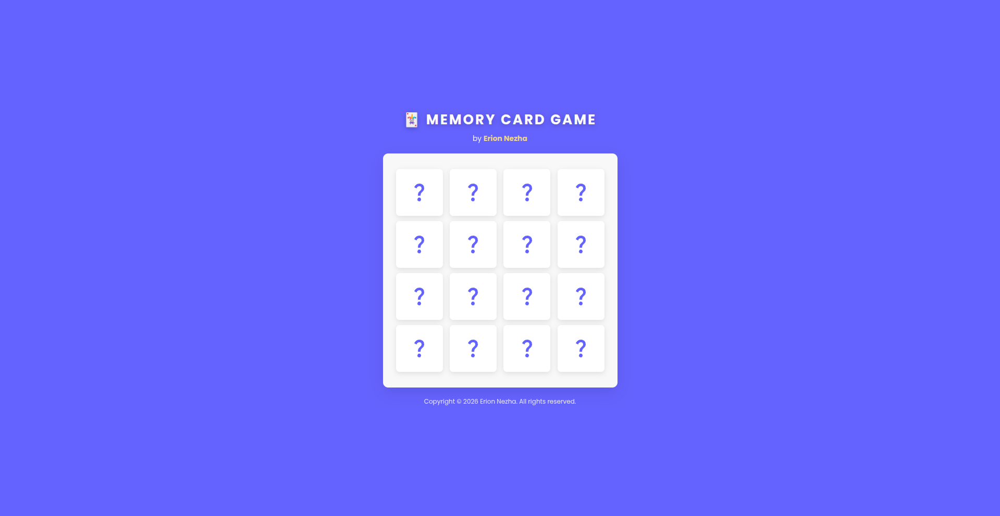

# 🃏 Loja e Letrave të Kujtesës 🇦🇱

Created by **Erion Nezha**

> Lojë klasike e letrave të kujtesës flip & match e ndërtuar me HTML, CSS dhe JavaScript.

**🔴 Demo live — luaje tani:** https://erionnezha.github.io/Memory-Card-Game/

## 🎮 Si luhet

1. Kliko çdo letër për ta kthyer.
2. Kthe një letër të dytë — nëse dy imazhet përputhen, çifti qëndron hapur.
3. Gjej të **8 çiftet që përputhen** për të pastruar tabelën. Letrat që nuk përputhen dridhen dhe kthehen mbrapsht.
4. Kuverta përzihet automatikisht kur fiton. 🔄

## ✨ Karakteristikat

- Animacione të lëmuara 3D të kthimit të letrave
- Përzierje në çdo raund — asnjë lojë nuk është e njëjtë
- Dridhje si reagim për përputhjet e gabuara
- Plotësisht responsive — luhet shkëlqyeshëm në celular

## 📄 Licenca

Copyright © 2026 Erion Nezha. Të gjitha të drejtat e rezervuara. Shih [LICENSE](LICENSE).

---

# 🃏 Memory Card Game 🇬🇧

> A classic flip & match memory card game built with HTML, CSS and JavaScript.

**🔴 Live demo — play it now:** https://erionnezha.github.io/Memory-Card-Game/

## 🎮 How to Play

1. Click any card to flip it over.
2. Flip a second card — if the two images match, the pair stays open.
3. Find all **8 matching pairs** to clear the board. Mismatched cards shake and flip back.
4. The deck reshuffles automatically when you win. 🔄

## ✨ Features

- Smooth 3D card-flip animations
- Shuffle on every round — no two games alike
- Shake feedback on wrong matches
- Fully responsive — plays great on mobile

## 📄 License

Copyright © 2026 Erion Nezha. All rights reserved. See [LICENSE](LICENSE).
